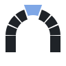
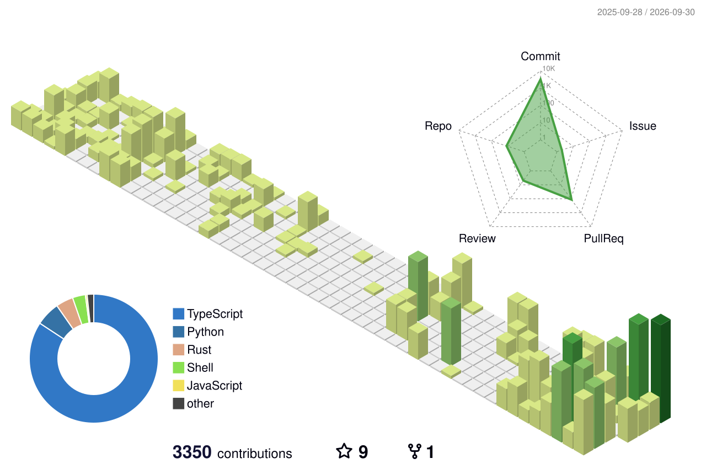

# Gent Bajko

<table>
  <tr>
    <td width="88" align="center"></td>
    <td>
      <strong><a href="https://github.com/DiceMasterIO">DiceMaster</a></strong> · Coming soon 
      An AI Dungeon Master for D&amp;D 5e. Intelligent NPCs, voice, and a virtual tabletop, for solo players and groups without a DM.
    </td>
  </tr>
  <tr>
    <td width="88" align="center"></td>
    <td>
      <strong><a href="https://github.com/DiceMasterIO/arda">Arda</a></strong> · Open source, Apache-2.0 
      Worlds from the ground up. Deterministic world generation in Rust: one seed produces a continent, resolved down to the 5-ft squares of a battle map.
    </td>
  </tr>
  <tr>
    <td width="88" align="center"><a href="https://businessdone.tech"><picture><source media="(prefers-color-scheme: dark)" srcset="./logos/businessdone-mark-dark.svg" /></picture></a></td>
    <td>
      <strong><a href="https://businessdone.tech">BusinessDone</a></strong> · Shipping 
      Turn a scanned legal bundle into a searchable, copyable PDF without changing the record. Batch processing, preserved layout, team access, retention and legal hold.
    </td>
  </tr>
  <tr>
    <td width="88" align="center"></td>
    <td>
      <strong><a href="https://gentbajko.dev/#clippa">Clippa</a></strong> · Private beta 
      The producer's rundown for a streamer who has no producer. Stream ends, the VOD is processed, long-form videos and vertical clips are prepared, and nothing uploads until you approve it. 
      <a href="https://gentbajko.dev/#clippa">Join the waitlist</a>
    </td>
  </tr>
  <tr>
    <td width="88" align="center"></td>
    <td>
      <strong><a href="https://slopify.stream">Slopify</a></strong> · On npm 
      A content studio that runs on your own machine. Give it a topic and it researches, writes, narrates, illustrates and edits it into videos and shorts, audiobooks, podcasts, articles or social posts. Your keys, and nothing runs without your say. 
      <code>npx @gentbajko/slopify@latest</code>
    </td>
  </tr>
  <tr>
    <td width="88" align="center"></td>
    <td>
      <strong><a href="https://archways.dev">Archways</a></strong> · Open source, Apache-2.0 
      Durable repository context for coding agents. No model, no service.
      <table>
        <tr>
          <td width="72" align="center"></td>
          <td>
            <strong><a href="https://github.com/GentBajko/capstone">Capstone</a></strong> 
            Your agent, on rails. Commit-stamped architecture docs inside a repo, so agents read decisions instead of re-exploring.
          </td>
        </tr>
        <tr>
          <td width="72" align="center"></td>
          <td>
            <strong><a href="https://github.com/GentBajko/quarry">Quarry</a></strong> 
            One face for every repo. Indexes those docs across repos and answers what a change could affect.
          </td>
        </tr>
      </table>
    </td>
  </tr>
</table>

**Writing** · The decisions behind the products: problem, constraints, architecture, tradeoffs, failure modes. [gentbajko.dev/articles](https://gentbajko.dev/articles)

**Open to senior and founding roles.** [me@gentbajko.dev](mailto:me@gentbajko.dev) · [LinkedIn](https://linkedin.com/in/gentbajko)

<!--  -->
